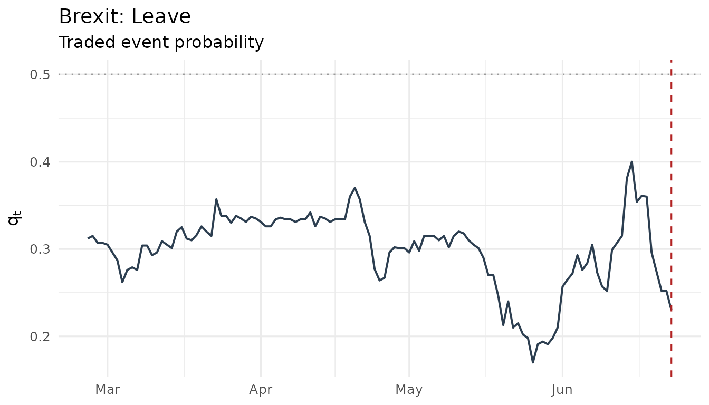
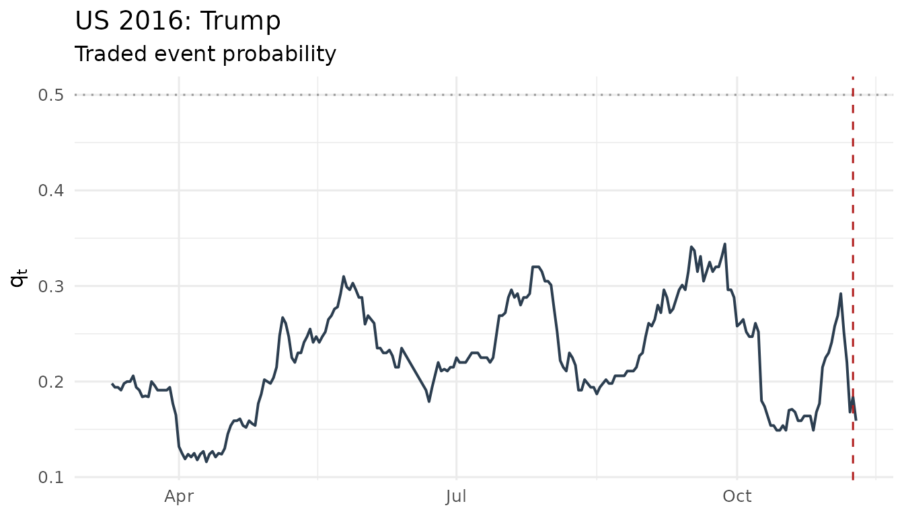
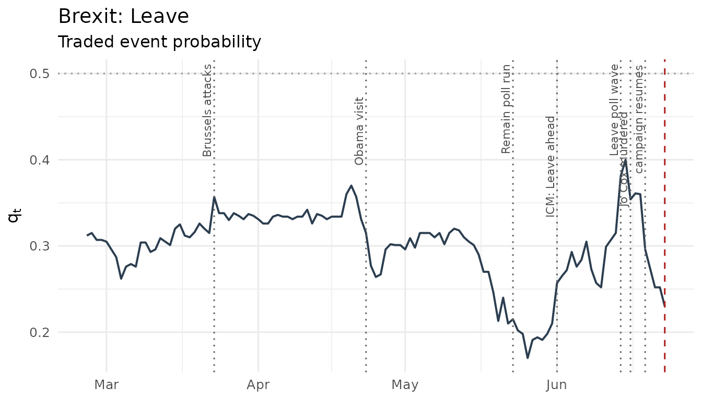
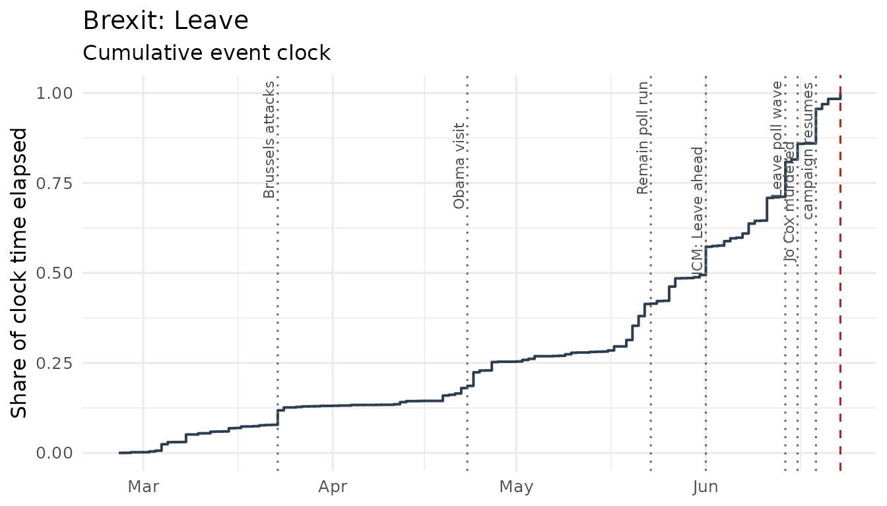
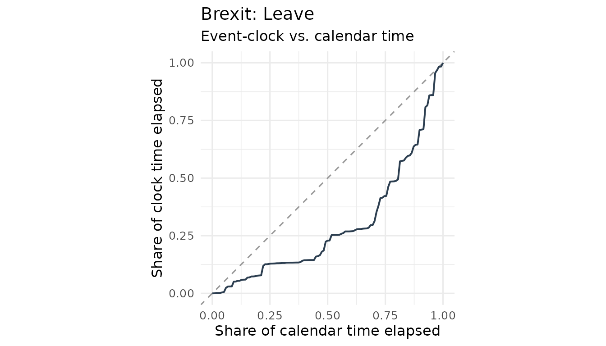
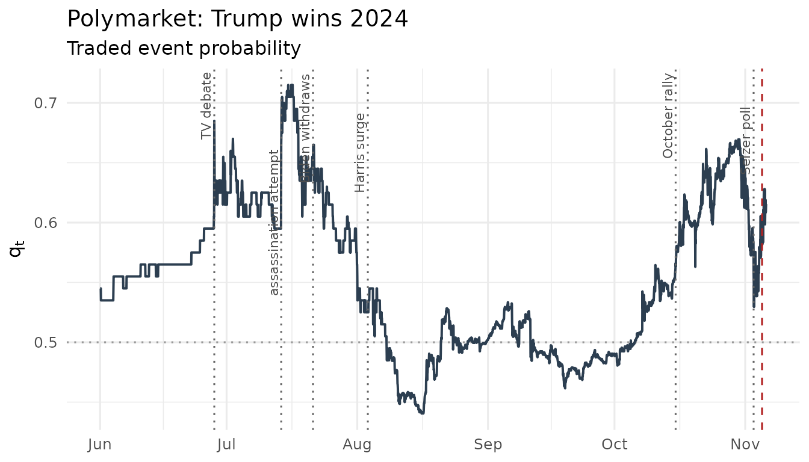
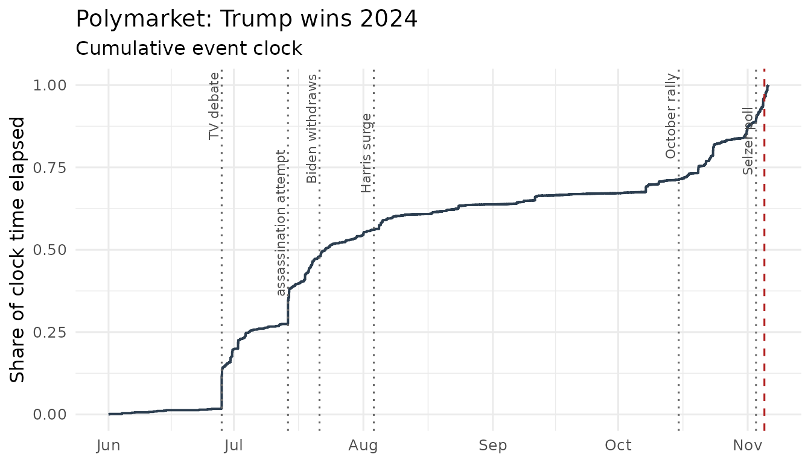
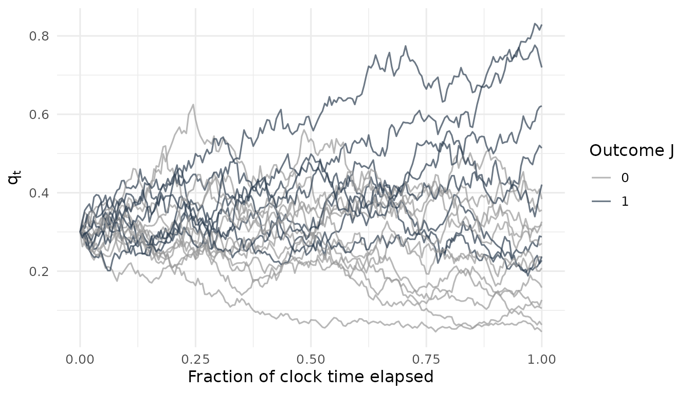

# Measuring the event clock: Brexit, the 2016 U.S. election, and Polymarket

``` r

library(eventclock)
```

## The event clock in one paragraph

Ahead of a scheduled event — a referendum, an election, a central-bank
decision — markets learn. The *event clock* measures how much
outcome-relevant information has arrived and when: event-clock time
$`A_{t,T}`$ is the quadratic variation of the log-odds
$`L_t = \mathrm{logit}(q_t)`$ of a traded event probability $`q_t`$,

``` math
\widehat A_{t,T} \;=\; \sum_{t_i \in [t,T)}
  \bigl[\mathrm{logit}(q_{t_{i+1}}) - \mathrm{logit}(q_{t_i})\bigr]^2 .
```

Because quadratic variation ignores drift and is invariant under
equivalent measure changes, $`\widehat A`$ needs no assumption about
risk premia, and any constant level distortion of $`q`$ (discounting, a
constant state-price tilt) drops out. The concept, identification
results, and the empirical applications reproduced below are developed
in Hanke, Schadner, Stöckl, and Weissensteiner (Working Paper),
*Learning Before Scheduled Events: Prediction Markets, State Prices, and
Option Valuation*.

## Two classic event windows: Brexit and the 2016 U.S. election

The package ships the two daily event-probability series used in the
working paper, both derived from betting quotes (see
[`?brexit2016`](https://www.sebastianstoeckl.com/eventclock/reference/brexit2016.md)):

``` r

data(brexit2016)
data(us2016)

ep_gb <- as_event_prices(brexit2016,
  time = "date", price = "q_leave",
  market_id = "Brexit: Leave", event_date = as.Date("2016-06-23")
)
ep_us <- as_event_prices(us2016,
  time = "date", price = "trump",
  market_id = "US 2016: Trump", event_date = as.Date("2016-11-08")
)

plot_q(ep_gb)
```



``` r

plot_q(ep_us)
```



## Reproducing the headline information-time table

The working paper evaluates the clock from the one-month valuation date
(May 24 / October 10, 2016) over one-week, two-week, and one-month
horizons, with a battery of robustness variants:

``` r

gb <- event_clock(ep_gb,
  from = as.Date("2016-05-24"),
  to = c(`1W` = as.Date("2016-05-31"), `2W` = as.Date("2016-06-07"),
         `1M` = as.Date("2016-06-23"))
)
us <- event_clock(ep_us,
  from = as.Date("2016-10-10"),
  to = c(`1W` = as.Date("2016-10-17"), `2W` = as.Date("2016-10-24"),
         `1M` = as.Date("2016-11-08"))
)

tab <- rbind(
  cbind(case = "Brexit", as.data.frame(gb[, c("horizon", "method", "A")])),
  cbind(case = "U.S. election", as.data.frame(us[, c("horizon", "method", "A")]))
)
knitr::kable(
  stats::reshape(tab,
    idvar = c("case", "horizon"), timevar = "method", direction = "wide"
  ),
  digits = 3,
  col.names = c("Case", "Horizon", "RV", "Truncated", "Bipower",
                "Largest-1", "Largest-2")
)
```

|     | Case          | Horizon |    RV | Truncated | Bipower | Largest-1 | Largest-2 |
|:----|:--------------|:--------|------:|----------:|--------:|----------:|----------:|
| 1   | Brexit        | 1W      | 0.064 |     0.064 |   0.060 |     0.029 |     0.009 |
| 6   | Brexit        | 2W      | 0.166 |     0.166 |   0.141 |     0.096 |     0.062 |
| 11  | Brexit        | 1M      | 0.510 |     0.510 |   0.374 |     0.425 |     0.341 |
| 16  | U.S. election | 1W      | 0.015 |     0.015 |   0.011 |     0.010 |     0.005 |
| 21  | U.S. election | 2W      | 0.046 |     0.046 |   0.025 |     0.021 |     0.016 |
| 26  | U.S. election | 1M      | 0.370 |     0.259 |   0.386 |     0.259 |     0.200 |

This reproduces the published table: Brexit $`\widehat A`$ of 0.064
(1W), 0.166 (2W), and 0.511 (1M) with bipower 0.375; U.S. election
0.015, 0.046, and 0.370 with bipower 0.386 and truncated 0.259.

Two details worth noting:

- **Truncation vs. largest-move exclusion.** The truncation rule (drop
  increments beyond 3 robust standard deviations) binds for the U.S.
  window — where it removes exactly the largest move and matches the
  published 0.259 — but not for the Brexit window, whose largest move
  stays inside the threshold. The published Brexit “truncated” value
  (0.426) corresponds to `largest1`. With daily data and short windows,
  always compare both columns.
- **Windows are anchored, not trailing.** “1M” runs from the valuation
  date to the event date; observations are calendar-daily including
  weekends.

## The clock over time

The most instructive object is not the point estimate but the *path* of
the clock — when did the information actually arrive? The jumps of the
cumulative clock have names: they are the campaign’s news days. (The
attributions below were found by ranking the days by their contribution
`dA` to the clock —
[`event_clock_path()`](https://www.sebastianstoeckl.com/eventclock/reference/event_clock_path.md)
returns exactly that column.)

``` r

# tiny helper used throughout: dotted line + label per event
# (labels alternate between two heights so that close-by events stay legible)
mark_events <- function(p, events) {
  drop <- rep(c(1.05, 1.55), length.out = nrow(events))
  p +
    ggplot2::geom_vline(
      xintercept = events$date, linetype = 3, color = "grey40"
    ) +
    ggplot2::annotate("text",
      x = events$date, y = Inf, label = events$label,
      angle = 90, vjust = -0.35, hjust = drop, size = 2.9, color = "grey30"
    )
}

events_gb <- data.frame(
  date = as.Date(c(
    "2016-03-23", "2016-04-23", "2016-05-23", "2016-06-01",
    "2016-06-14", "2016-06-16", "2016-06-19"
  )),
  label = c(
    "Brussels attacks", "Obama visit", "Remain poll run", "ICM: Leave ahead",
    "Leave poll wave", "Jo Cox murdered", "campaign resumes"
  )
)

path_gb <- event_clock_path(ep_gb)
mark_events(plot_q(ep_gb), events_gb)
```



``` r

mark_events(plot_clock(path_gb), events_gb)
```



The largest ticks of the Brexit clock, matched to the news of the day
(`dL` is the log-odds move of the *Leave* probability):

- **Mar 22–23** — Brussels terror attacks; Leave odds jump
  (`dL = +0.19`).
- **Apr 22–24** — Obama’s London visit (“back of the queue”); Remain
  boost (`dL = -0.18`).
- **May 20–26** — the Remain poll run (ORB Remain +15, Treasury/IMF
  warnings); `q_leave` hits its sample low of 0.17.
- **May 31 – Jun 1** — paired ICM phone/online polls put Leave ahead:
  the campaign’s turning point (`dL = +0.26`, 8% of the full-sample
  clock).
- **Jun 10–14** — the Leave poll wave plus The Sun’s endorsement — the
  single largest tick (`dL = +0.29`, 10%).
- **Jun 16** — the murder of Jo Cox; campaigning is suspended
  (`dL = -0.20`).
- **Jun 19–20** — campaigning resumes, Remain recovers in the weekend
  polls (`dL = -0.29`, 10%).

``` r

plot_clock_vs_calendar(path_gb)
```



A path below the 45-degree line means information is back-loaded — it
waits for the deadline; the June cluster of poll shocks is clearly
visible as the late steep segment.

## Real time versus ex post

Ex post, we know how much information arrived while an option was alive.
In real time we do not; the paper’s benchmark annualizes the trailing
40-observation realized variation and scales it to the horizon:

``` r

event_clock_forecast(ep_us,
  at = as.Date("2016-10-10"),
  horizon = c(`1W` = 7, `2W` = 14)
)
#> # A tibble: 2 × 9
#>   market_id  at         horizon horizon_days trailing n_incr n_gaps max_gap_days
#>   <chr>      <date>     <chr>          <dbl>    <int>  <int>  <int>        <dbl>
#> 1 US 2016: … 2016-10-10 1W                 7       40     39      0            1
#> 2 US 2016: … 2016-10-10 2W                14       40     39      0            1
#> # ℹ 1 more variable: A_forecast <dbl>
```

This reproduces the published real-time values of 0.068 (1W) and 0.135
(2W) for the U.S. election — the market expected far more learning than
the 0.015/0.046 that actually materialized before election week.

## Why levels do not matter: the wedge property

On the paper’s valuation date, the raw betting-quote probability of
*Leave* is $`q = 0.202`$, while the paper works with a
USD-state-price-converted $`q = 0.195`$. The levels differ — but the
clock is identical, because an (approximately) constant logit wedge has
zero quadratic variation:

``` r

shifted <- brexit2016
shifted$q_leave <- ec_ilogit(ec_logit(brexit2016$q_leave) + 0.5)
ep_shift <- as_event_prices(shifted, time = "date", price = "q_leave")

c(
  original = event_clock(ep_gb, from = as.Date("2016-05-24"),
                         methods = "rv")$A,
  shifted = event_clock(ep_shift, from = as.Date("2016-05-24"),
                        methods = "rv")$A
)
#> original  shifted 
#> 0.510469 0.510469
```

## The formula book

Once $`q`$ and $`A`$ are measured, a family of closed-form objects
follows from the exact logistic-normal transition law
$`L_T = L_t + (\mathbf{1}\{J=1\} - \tfrac12) A + \sqrt{A}\,\zeta`$. The
worked Brexit example ($`q = 0.195`$, $`A = 0.166`$):

``` r

ec_moments(q = 0.195, A = 0.166)
#> # A tibble: 1 × 10
#>       q     A     L  E_qT  E_LT var_LT sd_LT    m3_LT  var_qT var_qT_bound
#>   <dbl> <dbl> <dbl> <dbl> <dbl>  <dbl> <dbl>    <dbl>   <dbl>        <dbl>
#> 1 0.195 0.166 -1.42 0.195 -1.47  0.170 0.413 0.000438 0.00409       0.0104

# typical revision over the window: about 5 probability points
ec_revision(q = 0.195, A = 0.166)
#> [1] 0.05102989

# probability of ending above 50% by resolution
ec_exceedance(0.5, q = 0.195, A = 0.166)
#> [1] 0.0001951016

# clock time needed to move from 19.5% to "90% sure": about 40x
# the two-week clock
ec_target_clock(q = 0.195, target = 0.9) / 0.166
#> [1] 43.55503
```

The rule of thumb for the implied-volatility contribution of event
learning,
$`\Delta\mathrm{IV} \approx [\Delta\eta\, q(1-q)]^2 A \,/\, (2\sigma(T-t))`$,
reproduces the paper’s headline decomposition (in annualized IV
percentage points, using the tenor-specific no-learning ATM volatility
and the event exposures $`\Delta\eta`$ estimated in the paper):

``` r

c(
  brexit_2w = 100 * ec_iv_rule(deta = -0.012, q = 0.195, A = 0.166,
                               sigma = 0.10590, tenor = 14 / 365),
  us_2w     = 100 * ec_iv_rule(deta = -0.099, q = 0.172, A = 0.046,
                               sigma = 0.19326, tenor = 14 / 365)
)
#>   brexit_2w       us_2w 
#> 0.007250541 0.061679188
```

Learning was priced at well under a tenth of a volatility point for
Brexit but an order of magnitude more for the U.S. election — the
$`(\Delta\eta)^2`$ lever dominates.

## The event clock on live Polymarket data

The package connects to the public, keyless Polymarket APIs. The shipped
`polymarket2024` dataset was downloaded with exactly this code:

``` r

# 1. find the event and the "Yes" token
pm_search("presidential election winner 2024")
mkts <- pm_markets("presidential-election-winner-2024")
tok <- mkts$token_id[grepl("Trump", mkts$question) & mkts$outcome == "Yes"]

# 2. pull the hourly price history (chunked automatically)
ep24 <- pm_prices(tok, from = "2024-06-01", to = "2024-11-06",
                  market_id = "Polymarket: Trump wins 2024",
                  event_date = as.POSIXct("2024-11-05", tz = "UTC"))
```

``` r

data(polymarket2024)
ep24 <- as_event_prices(polymarket2024,
  market_id = "Polymarket: Trump wins 2024",
  event_date = as.POSIXct("2024-11-05", tz = "UTC")
)

events_24 <- data.frame(
  date = as.POSIXct(c(
    "2024-06-28 02:00", "2024-07-13 23:00", "2024-07-21 12:00",
    "2024-08-03 12:00", "2024-10-15 12:00", "2024-11-03 00:00"
  ), tz = "UTC"),
  label = c(
    "TV debate", "assassination attempt", "Biden withdraws",
    "Harris surge", "October rally", "Selzer poll"
  )
)

mark_events(plot_q(ep24), events_24)
```



``` r

mark_events(plot_clock(event_clock_path(ep24)), events_24)
```



The jumps of the 2024 clock, again matched by ranking the daily
contributions (`dL` on the Trump-Yes log-odds):

- **Jun 27–28** — the Biden–Trump TV debate: the largest *hourly* move
  of the whole sample (`dL = +0.35`), while the debate was still on air.
- **Jul 13–14** — the assassination attempt: the largest tick overall
  (`dL = +0.42`) — **22% of the entire five-month clock in one day**.
- **Jul 17–21** — Biden’s withdrawal: mostly priced in by the July 17
  reports; the announcement itself is a modest tick.
- **Aug 1–10** — Harris secures the nomination, picks Walz, and surges
  (`dL = -0.20` and `-0.14`).
- **early–mid Oct** — the October rally (`dL` of `+0.11` to `+0.16` on
  Oct 7/15/22), with a sharp intraday reversal on Oct 23.
- **Nov 2–3** — the Selzer Iowa poll shock (`dL = -0.17`), reversed the
  next day; then election night.

Conspicuously absent: the **September 10 Harris–Trump debate** does not
rank among the top ticks — the market priced it as barely informative,
which is exactly what the long September plateau of the clock shows.

With intraday data, mind the sampling frequency: microstructure noise
(bid-ask bounce on a coarse tick grid) inflates measured variation.
Collapsing to one daily snapshot (last price at or before 16:00 New York
time) is a robust default:

``` r

c(
  hourly = event_clock(ep24, methods = "rv")$A,
  daily  = event_clock(pm_daily(ep24), methods = "rv")$A
)
#>    hourly     daily 
#> 1.2631246 0.7756132
```

## Simulating clock-consistent paths

For teaching and testing,
[`ec_simulate_path()`](https://www.sebastianstoeckl.com/eventclock/reference/ec_simulate_path.md)
composes the exact transition law into full probability paths whose
realized clock matches the input $`A`$ and whose probabilities are
martingales by construction:

``` r

set.seed(1)
paths <- ec_simulate_path(n_paths = 20, n_steps = 200, q = 0.3, A = 1)

library(ggplot2)
ggplot(paths, aes(t_frac, q, group = path,
                  color = factor(J))) +
  geom_line(alpha = 0.7) +
  scale_color_manual(values = c(`0` = "grey60", `1` = "#2c3e50"),
                     name = "Outcome J") +
  labs(x = "Fraction of clock time elapsed", y = expression(q[t])) +
  theme_minimal(base_size = 12)
```



## Citation

If you use the package or the event-clock methodology, please cite:

> Hanke, M., Schadner, W., Stöckl, S., and Weissensteiner, A. (2026).
> *Learning Before Scheduled Events: Prediction Markets, State Prices,
> and Option Valuation.* Working Paper.

See `citation("eventclock")`.
