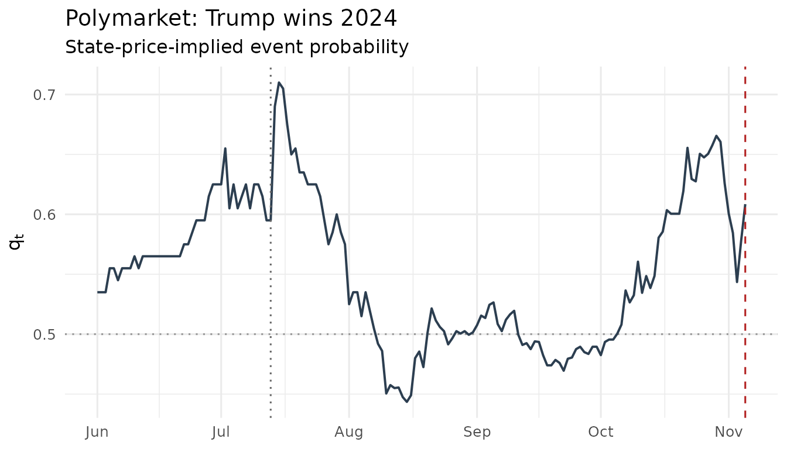

# Event betas: assets on the event clock

``` r

library(eventclock)
```

## From the clock to asset prices

The event clock answers “how much was learned, and when”. The asset side
asks: “who cares?” To first order, an asset whose event multiplier has
outcome-conditional means $`\eta_1, \eta_2`$ responds to probability
news as
``` math
 r_t \;\approx\; \Delta\eta \,\Delta q_t, \qquad
   \Delta\eta = \eta_1 - \eta_2, 
```
so a regression of returns on probability innovations recovers the
*event exposure* $`\widehat{\Delta\eta}`$ — that is
[`event_beta()`](https://www.sebastianstoeckl.com/eventclock/reference/event_beta.md).

**What returns can and cannot identify.** Returns pin down only the
spread $`\Delta\eta`$, not the levels $`\eta_1, \eta_2`$ separately, and
not the outcome-conditional dispersions: those require event-spanning
option smiles. Two consequences:

- the levels reported by
  [`event_beta()`](https://www.sebastianstoeckl.com/eventclock/reference/event_beta.md)
  come from the pricing-measure adding-up constraint
  $`q\eta_1 + (1-q)\eta_2 = 1`$ — they are model-implied, not
  independently identified;
- the loading test $`\beta = 1`$ is meaningful only against an
  *externally* measured exposure (option-implied, or from an independent
  sample); regressing and testing against the same
  $`\widehat{\Delta\eta}`$ would be circular. Supply it via the `deta`
  argument when you have one.

## DJT and the 2024 election

The most exposed listed asset to the 2024 U.S. presidential election was
Trump Media & Technology Group. Both ingredients ship with the package:

``` r

data(djt2024)
data(polymarket2024)
ep <- pm_daily(as_event_prices(polymarket2024,
  market_id = "Polymarket: Trump wins 2024",
  event_date = as.POSIXct("2024-11-05", tz = "UTC")
))

eb <- event_beta(djt2024, ep)
eb
#> -- Event-beta regression (Newey-West, 4 lags)
#> Event exposure deta_hat = 1.2765 (se 0.4838, t = 2.64), n = 108, R^2 = 0.064
#> Model-implied levels at mean q = 0.554: eta1 = 1.5699, eta2 = 0.2934
#> (No external deta supplied: levels/loading test not identified from returns alone.)
```

The exposure is large — a ten-point move in the win probability moves
the stock by roughly $`0.1 \times \widehat{\Delta\eta} \times 100`$
percent — and highly significant despite the stock’s enormous
idiosyncratic (meme) volatility, which keeps the $`R^2`$ modest. The
regression $`R^2`$*is* the realized variance share of event news over
the sample.

The assassination-attempt weekend makes the mechanism visible in a
single observation: the win probability jumped by about 9 points and the
stock opened 27% higher on Monday, July 15.

``` r

plot(ep) +
  ggplot2::geom_vline(xintercept = as.Date("2024-07-13"),
                      linetype = 3, color = "grey40")
```



## Is the event first-order for option prices? The relevance screen

Given an exposure, the *sufficient statistic* for whether event learning
matters for an asset’s option prices is the ratio of learning variance
to no-learning variance, $`\rho = [\Delta\eta\,
q(1-q)]^2 A / (\sigma^2 T)`$:

``` r

# ingredients: measured clock, measured exposure, the asset's own vol
A_2w <- event_clock(ep, from = as.Date("2024-10-22"),
                    to = as.Date("2024-11-05"), methods = "rv")$A
sigma_djt <- sd(diff(log(djt2024$adjusted))) * sqrt(252)
q_pre <- ep$q[ep$time == as.Date("2024-10-22")]

rho <- ec_relevance(deta = eb$deta_hat, q = q_pre, A = A_2w,
                    sigma = sigma_djt, tenor = 14 / 365)
c(rho = rho, variance_share = rho / (1 + rho),
  iv_rule_pp = 100 * sigma_djt * rho / 2)
#>            rho variance_share     iv_rule_pp 
#>      0.1609872      0.1386641     10.5625361
```

Compare this with an FX pair around the same election: with
$`|\Delta\eta|`$ two orders of magnitude smaller, $`\rho`$ collapses to
rounding-error size — the four-lever anatomy of the first-order
expansion (exposure squared, movability squared, clock, dilution)
decides who cares about the event.

## One pipeline, many state prices

Any traded event state price feeds the same $`q \to L \to A`$ machinery.
Two more converters ship with the package.

**Fed funds futures.** The 30-day fed funds future for a meeting month
settles on the monthly average rate; the standard extraction turns its
price into a meeting-implied move probability:

``` r

data(fomc_meetings)
subset(fomc_meetings, year == 2024)[5:8, ]
#> # A tibble: 4 × 3
#>   decision_date  year sep  
#>   <date>        <int> <lgl>
#> 1 2024-07-31     2024 FALSE
#> 2 2024-09-18     2024 TRUE 
#> 3 2024-11-07     2024 FALSE
#> 4 2024-12-18     2024 TRUE

# decision on the 15th of a 30-day month, pre-meeting rate 5.33%,
# futures at 94.79: a 25bp cut is ~96% priced
q_from_ffutures(94.79, pre_rate = 5.33,
                meeting_date = as.Date("2024-09-15"), step = -0.25)
#> # A tibble: 1 × 5
#>   meeting_date implied_avg implied_post delta_rate     q
#>   <date>             <dbl>        <dbl>      <dbl> <dbl>
#> 1 2024-09-15          5.21         5.09     -0.240 0.960
```

**Merger-arb spreads.** A takeover target’s price is itself an event
state price; the deal clock is the logit-QV of the implied completion
probability:

``` r

target_path <- c(40, 41.5, 41, 44, 46, 45.5, 47, 48.5)
q <- q_from_deal_spread(target_path, offer = 50, fallback = 35)
deal <- as_event_prices(
  tibble::tibble(time = as.Date("2025-01-06") + seq_along(q) * 7, q = q),
  market_id = "Deal clock (toy example)"
)
event_clock(deal, methods = c("rv", "bipower"))
#> # A tibble: 2 × 10
#>   market_id       from       to         horizon n_obs n_incr n_gaps max_gap_days
#>   <chr>           <date>     <date>     <chr>   <int>  <int>  <int>        <dbl>
#> 1 Deal clock (to… 2025-01-13 2025-03-03 2025-0…     8      7      0            7
#> 2 Deal clock (to… 2025-01-13 2025-03-03 2025-0…     8      7      0            7
#> # ℹ 2 more variables: method <chr>, A <dbl>
```

## Practical notes

- Match frequencies: with daily returns, collapse intraday probability
  data first
  ([`pm_daily()`](https://www.sebastianstoeckl.com/eventclock/reference/pm_daily.md)).
- Screen the probability series with
  [`ec_validate()`](https://www.sebastianstoeckl.com/eventclock/reference/ec_validate.md)
  and the sampling frequency with
  [`ec_signature()`](https://www.sebastianstoeckl.com/eventclock/reference/ec_signature.md)
  before interpreting exposures.
- Newey-West lags default to $`\lfloor 4(n/100)^{2/9} \rfloor`$; pass
  `lags = 0` for plain heteroskedasticity-robust errors.
- Add market/factor controls via `controls =` to isolate the event
  channel from general market comovement.
