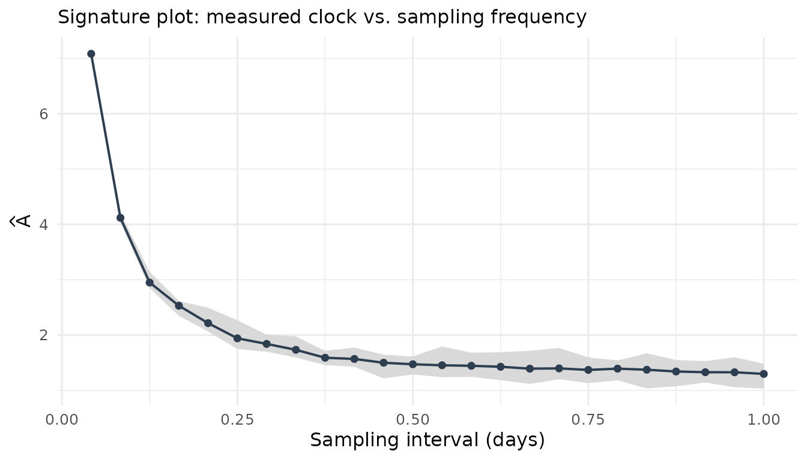
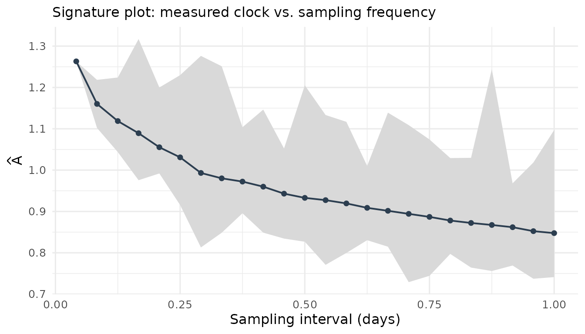

# Validating the event-clock estimator

``` r

library(eventclock)
```

This vignette stress-tests the estimator
$`\widehat A = \sum (\Delta L)^2`$ against data simulated from the
*exact* transition law of the model
([`ec_simulate_path()`](https://www.sebastianstoeckl.com/eventclock/dev/reference/ec_simulate_path.md)),
so every deviation is attributable to the estimator, not to model error.
Helper to turn simulated paths into `event_prices`:

``` r

path_to_ep <- function(p) {
  as_event_prices(
    tibble::tibble(time = as.Date("2020-01-01") + p$step, q = p$q),
    clip = c(1e-8, 1 - 1e-8)
  )
}

estimate_A <- function(n_steps, A, q = 0.4, reps = 200, ...) {
  vapply(seq_len(reps), function(i) {
    p <- ec_simulate_path(1, n_steps, q = q, A = A, ...)
    event_clock(path_to_ep(p), methods = "rv")$A
  }, numeric(1))
}
```

## Consistency and finite-sample precision

The estimator is unbiased at every sampling frequency (up to the tiny
$`\sum a_i^2/4`$ drift term) and its dispersion shrinks with the number
of observations:

``` r

grid <- c(15, 30, 60, 120, 250)
sims <- lapply(grid, estimate_A, A = 0.5)
tab <- data.frame(
  n_obs = grid,
  mean = sapply(sims, mean),
  bias_pct = 100 * (sapply(sims, mean) / 0.5 - 1),
  sd = sapply(sims, sd),
  rmse = sapply(sims, function(s) sqrt(mean((s - 0.5)^2)))
)
knitr::kable(tab, digits = 3)
```

| n_obs |  mean | bias_pct |    sd |  rmse |
|------:|------:|---------:|------:|------:|
|    15 | 0.520 |    3.986 | 0.202 | 0.203 |
|    30 | 0.522 |    4.468 | 0.132 | 0.134 |
|    60 | 0.505 |    0.964 | 0.088 | 0.088 |
|   120 | 0.502 |    0.427 | 0.070 | 0.070 |
|   250 | 0.501 |    0.289 | 0.043 | 0.043 |

Even the paper-sized windows (a one-month window has about 30 daily
observations) are unbiased; the price of short windows is dispersion,
not bias — which is why interval estimates matter.

## Confidence-interval coverage

`event_clock(se = TRUE)` reports quarticity-based standard errors with
log-scale intervals. Their coverage is close to nominal:

``` r

coverage <- function(conf, reps = 300, n_steps = 60, A = 0.5) {
  hits <- vapply(seq_len(reps), function(i) {
    p <- ec_simulate_path(1, n_steps, q = 0.4, A = A)
    r <- event_clock(path_to_ep(p), methods = "rv", se = TRUE, conf = conf)
    r$ci_lo <= A && A <= r$ci_hi
  }, logical(1))
  mean(hits)
}
data.frame(
  nominal = c(0.90, 0.95),
  empirical = c(coverage(0.90), coverage(0.95))
)
#>   nominal empirical
#> 1    0.90 0.8833333
#> 2    0.95 0.9500000
```

## Outcome independence: the measure-robustness property in action

Quadratic variation does not care which outcome eventually realizes —
this is the observable footprint of measure robustness (a change of
measure reweights outcomes; it cannot change the estimate computed from
a given path):

``` r

p <- ec_simulate_path(400, 60, q = 0.4, A = 0.5)
qv <- vapply(split(p$L, p$path), function(L) sum(diff(L)^2), numeric(1))
J <- vapply(split(p$J, p$path), function(j) j[1], numeric(1))
data.frame(
  outcome = c("J = 1", "J = 0"),
  mean_A_hat = c(mean(qv[J == 1]), mean(qv[J == 0])),
  n_paths = c(sum(J == 1), sum(J == 0))
)
#>   outcome mean_A_hat n_paths
#> 1   J = 1  0.4935467     169
#> 2   J = 0  0.5079064     231
```

Both conditional means sit at the same true $`A = 0.5`$: the clock
measures *how much* was learned, not *what* was learned.

## Lumpy information: what the robustness variants actually do

Real event clocks are lumpy — debates and verdicts, not a smooth flow.
With `jump_share`, the simulator concentrates part of $`A`$ in a few
jump steps, and the estimator battery reacts exactly as the theory says
it should:

``` r

lumpy <- lapply(seq_len(200), function(i) {
  p <- ec_simulate_path(1, 60, q = 0.4, A = 0.5,
                        jump_share = 0.5, n_jumps = 1)
  event_clock(path_to_ep(p))[, c("method", "A")]
})
agg <- do.call(rbind, lumpy)
knitr::kable(
  aggregate(A ~ method, data = agg, FUN = mean),
  digits = 3,
  caption = "Mean estimate across 200 lumpy paths (true A = 0.5, half of it in one jump)"
)
```

| method    |     A |
|:----------|------:|
| bipower   | 0.301 |
| largest1  | 0.240 |
| largest2  | 0.214 |
| rv        | 0.502 |
| truncated | 0.236 |

Mean estimate across 200 lumpy paths (true A = 0.5, half of it in one
jump) {.table}

`rv` recovers total clock time including the jump; `bipower`,
`truncated`, and `largest1` estimate (roughly) the *smooth* component
only — the gap between `rv` and `bipower` is the jumpiness index. None
of these is “wrong”; they answer different questions, and comparing them
is the point.

## Microstructure noise and the snapshot rule

Traded quotes bounce between bid and ask on a coarse tick grid. Additive
noise inflates measured variation at fine sampling — the classic
signature-plot diagnostic, here on simulated data with known truth:

``` r

p <- ec_simulate_path(1, 2000, q = 0.4, A = 1)
noisy <- ec_ilogit(p$L + rnorm(nrow(p), sd = 0.04))
ep_noisy <- as_event_prices(
  tibble::tibble(time = as.POSIXct("2024-01-01", tz = "UTC") +
                   3600 * p$step, q = noisy),
  clip = c(1e-8, 1 - 1e-8)
)
plot_signature(ec_signature(ep_noisy, max_every = 24))
```



The finest grid overstates the clock (noise variance is counted once per
increment); sparse sampling converges toward the true $`A = 1`$. On real
data the same pattern appears — this is the hourly-vs-daily gap of the
2024 Polymarket series:

``` r

data(polymarket2024)
plot_signature(ec_signature(as_event_prices(polymarket2024), max_every = 24))
```



which is why the one-snapshot-per-day rule of
[`pm_daily()`](https://www.sebastianstoeckl.com/eventclock/dev/reference/pm_daily.md)
is the robust default for daily-horizon work.

## Data-quality screening

Before estimating anything, screen the input series:

``` r

ec_validate(as_event_prices(brexit2016, time = "date", price = "q_leave",
                            market_id = "Brexit: Leave"))
#> -- Event-price data-quality report: Brexit: Leave
#> Coverage:  119 obs, 2016-02-26 to 2016-06-23, median spacing 1 days, 0 NA
#> Clipping:  0.0% of observations outside the clipping bounds
#> Staleness: 11.0% zero increments, longest stale run 2 obs
#> Tick:      smallest non-zero move 0.001
#> Gaps:      0 gap increment(s), largest 1 days
#> Outliers:  max |dL| = 0.292 (5.5 robust SDs)
```

[`ec_validate()`](https://www.sebastianstoeckl.com/eventclock/dev/reference/ec_validate.md)
reports coverage, staleness, tick size, gaps, and outliers — in the
package’s flag-don’t-drop spirit: nothing is altered, everything is
visible.
