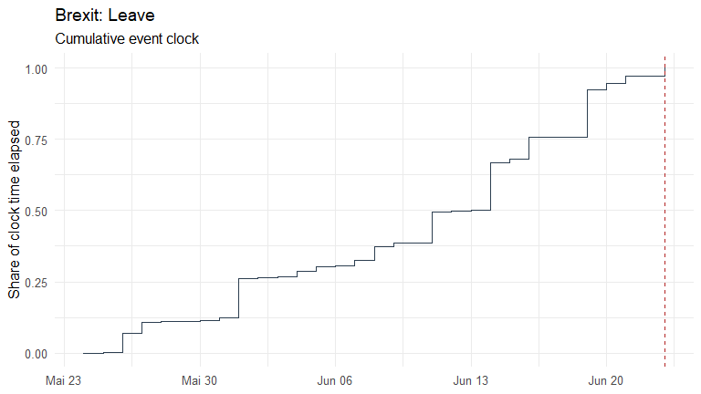

# eventclock

`eventclock` measures **event-clock time** (information time) ahead of
scheduled events — referendums, elections, central-bank decisions — from
traded event state prices such as prediction-market contracts.
Event-clock time $`A_{t,T}`$ is the quadratic variation of the log-odds
of the state-price-implied event probability: how much outcome-relevant
information arrived, and when.

The package implements the estimators, closed-form calculators, and
datasets of the working paper

> Hanke, M., Schadner, W., Stöckl, S., and Weissensteiner, A. (2026).
> *Learning Before Scheduled Events: Prediction Markets, State Prices,
> and Option Valuation.* Working Paper.

## Features

- **[`as_event_prices()`](https://www.sebastianstoeckl.com/eventclock/reference/as_event_prices.md)**
  — standardize any probability series (prediction markets, betting
  quotes, state prices) with flag-don’t-drop cleaning; converters
  [`q_from_price()`](https://www.sebastianstoeckl.com/eventclock/reference/q_from_price.md)
  (discount / overround),
  [`q_from_ffutures()`](https://www.sebastianstoeckl.com/eventclock/reference/q_from_ffutures.md)
  (fed funds futures, 25bp grid), and
  [`q_from_deal_spread()`](https://www.sebastianstoeckl.com/eventclock/reference/q_from_deal_spread.md)
  (merger-arb deal clocks); data screening with
  [`ec_validate()`](https://www.sebastianstoeckl.com/eventclock/reference/ec_validate.md).
- **[`event_clock()`](https://www.sebastianstoeckl.com/eventclock/reference/event_clock.md)**
  — realized-variation estimator of $`A`$ with truncation, bipower, and
  largest-move robustness variants, plus standard errors and confidence
  intervals (`se = TRUE`, quarticity or wild bootstrap);
  **[`event_clock_path()`](https://www.sebastianstoeckl.com/eventclock/reference/event_clock_path.md)**
  for the cumulative clock over time;
  **[`event_clock_forecast()`](https://www.sebastianstoeckl.com/eventclock/reference/event_clock_forecast.md)**
  for the trailing-window real-time benchmark;
  **[`ec_signature()`](https://www.sebastianstoeckl.com/eventclock/reference/ec_signature.md)**
  for the sampling-frequency (microstructure) diagnostic.
- **Assets & finance** —
  [`event_beta()`](https://www.sebastianstoeckl.com/eventclock/reference/event_beta.md):
  realized event exposures $`\widehat{\Delta\eta}`$ from returns with
  Newey-West errors and the $`\beta = 1`$ loading test against an
  external exposure;
  [`ec_relevance()`](https://www.sebastianstoeckl.com/eventclock/reference/ec_relevance.md):
  the sufficient statistic for pricing relevance.
- **Formula book** — closed-form calculators in $`(q, A)`$:
  [`ec_moments()`](https://www.sebastianstoeckl.com/eventclock/reference/ec_moments.md),
  [`ec_exceedance()`](https://www.sebastianstoeckl.com/eventclock/reference/ec_exceedance.md),
  [`ec_revision()`](https://www.sebastianstoeckl.com/eventclock/reference/ec_revision.md),
  [`ec_atm_event_call()`](https://www.sebastianstoeckl.com/eventclock/reference/ec_atm_event_call.md),
  [`ec_sigma_eff()`](https://www.sebastianstoeckl.com/eventclock/reference/ec_sigma_eff.md),
  [`ec_variance_share()`](https://www.sebastianstoeckl.com/eventclock/reference/ec_variance_share.md),
  [`ec_iv_rule()`](https://www.sebastianstoeckl.com/eventclock/reference/ec_iv_rule.md),
  [`ec_target_clock()`](https://www.sebastianstoeckl.com/eventclock/reference/ec_target_clock.md);
  exact transition law and simulators with lumpy-information jumps
  ([`ec_transition_density()`](https://www.sebastianstoeckl.com/eventclock/reference/ec_transition_density.md),
  [`ec_simulate()`](https://www.sebastianstoeckl.com/eventclock/reference/ec_simulate.md),
  [`ec_simulate_path()`](https://www.sebastianstoeckl.com/eventclock/reference/ec_simulate_path.md)).
- **Polymarket connector** —
  [`pm_search()`](https://www.sebastianstoeckl.com/eventclock/reference/pm_search.md),
  [`pm_markets()`](https://www.sebastianstoeckl.com/eventclock/reference/pm_markets.md),
  [`pm_prices()`](https://www.sebastianstoeckl.com/eventclock/reference/pm_prices.md),
  [`pm_daily()`](https://www.sebastianstoeckl.com/eventclock/reference/pm_daily.md)
  on the public, keyless Gamma/CLOB APIs.
- **Datasets** — `brexit2016`, `us2016` (the working paper’s event
  windows), `polymarket2024` (hourly 2024 U.S. election prices),
  `djt2024` (the matching exposed stock), and `fomc_meetings` (2021-2027
  FOMC calendar).
- **Plots** —
  [`plot_q()`](https://www.sebastianstoeckl.com/eventclock/reference/plot_q.md),
  [`plot_clock()`](https://www.sebastianstoeckl.com/eventclock/reference/plot_clock.md),
  [`plot_clock_vs_calendar()`](https://www.sebastianstoeckl.com/eventclock/reference/plot_clock_vs_calendar.md),
  [`plot_signature()`](https://www.sebastianstoeckl.com/eventclock/reference/plot_signature.md).

## Installation

``` r

# install.packages("devtools")
devtools::install_github("sstoeckl/eventclock")
```

## Quick start

``` r

library(eventclock)

ep <- as_event_prices(brexit2016,
  time = "date", price = "q_leave",
  market_id = "Brexit: Leave", event_date = as.Date("2016-06-23")
)

# the working paper's headline estimates
event_clock(ep,
  from = as.Date("2016-05-24"),
  to = c(`1W` = as.Date("2016-05-31"), `2W` = as.Date("2016-06-07"),
         `1M` = as.Date("2016-06-23"))
)
#> # A tibble: 15 × 10
#>    market_id     from       to         horizon n_obs n_incr n_gaps max_gap_days
#>    <chr>         <date>     <date>     <chr>   <int>  <int>  <int>        <dbl>
#>  1 Brexit: Leave 2016-05-24 2016-05-31 1W          8      7      0            1
#>  2 Brexit: Leave 2016-05-24 2016-05-31 1W          8      7      0            1
#>  3 Brexit: Leave 2016-05-24 2016-05-31 1W          8      7      0            1
#>  4 Brexit: Leave 2016-05-24 2016-05-31 1W          8      7      0            1
#>  5 Brexit: Leave 2016-05-24 2016-05-31 1W          8      7      0            1
#>  6 Brexit: Leave 2016-05-24 2016-06-07 2W         15     14      0            1
#>  7 Brexit: Leave 2016-05-24 2016-06-07 2W         15     14      0            1
#>  8 Brexit: Leave 2016-05-24 2016-06-07 2W         15     14      0            1
#>  9 Brexit: Leave 2016-05-24 2016-06-07 2W         15     14      0            1
#> 10 Brexit: Leave 2016-05-24 2016-06-07 2W         15     14      0            1
#> 11 Brexit: Leave 2016-05-24 2016-06-23 1M         31     30      0            1
#> 12 Brexit: Leave 2016-05-24 2016-06-23 1M         31     30      0            1
#> 13 Brexit: Leave 2016-05-24 2016-06-23 1M         31     30      0            1
#> 14 Brexit: Leave 2016-05-24 2016-06-23 1M         31     30      0            1
#> 15 Brexit: Leave 2016-05-24 2016-06-23 1M         31     30      0            1
#> # ℹ 2 more variables: method <chr>, A <dbl>
```

``` r

plot_clock(event_clock_path(ep, from = as.Date("2016-05-24")))
```



Live data from Polymarket:

``` r

mkts <- pm_markets("presidential-election-winner-2024")
tok <- mkts$token_id[grepl("Trump", mkts$question) & mkts$outcome == "Yes"]
ep24 <- pm_prices(tok, from = "2024-06-01", to = "2024-11-06")
event_clock(pm_daily(ep24))
```

(An alternative community client for the same APIs is
[polymarketR](https://github.com/clintmckenna/polymarketR).)

See the vignette for the full tour:
[`vignette("eventclock-brexit", package = "eventclock")`](https://www.sebastianstoeckl.com/eventclock/articles/eventclock-brexit.md).

## Citation

``` r

citation("eventclock")
```

Please cite the working paper above when you use the event-clock
methodology.

## License

MIT © Sebastian Stöckl
